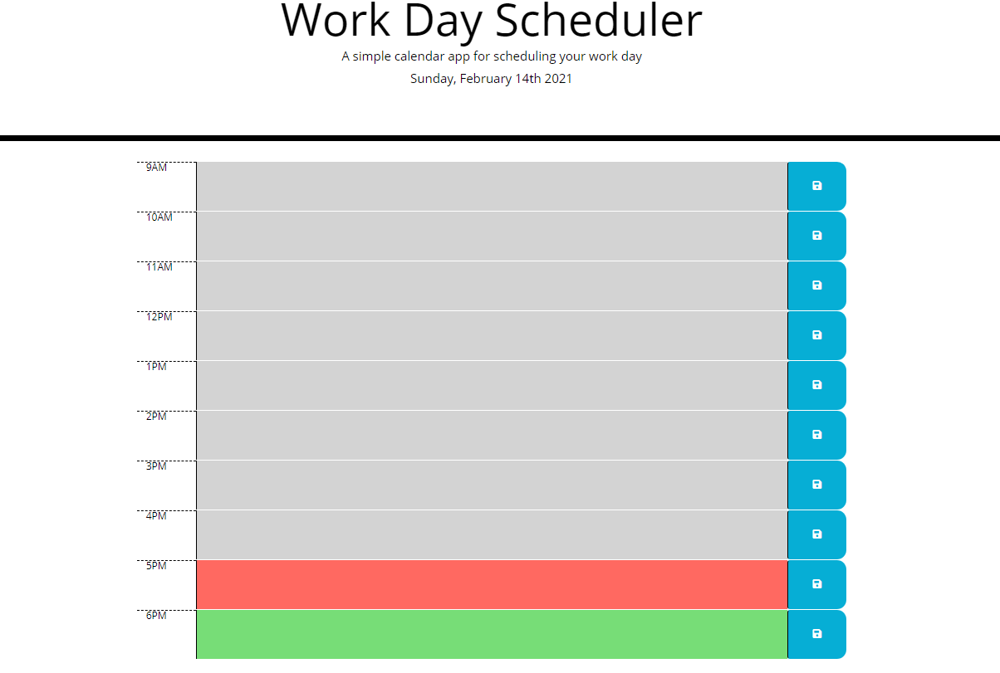
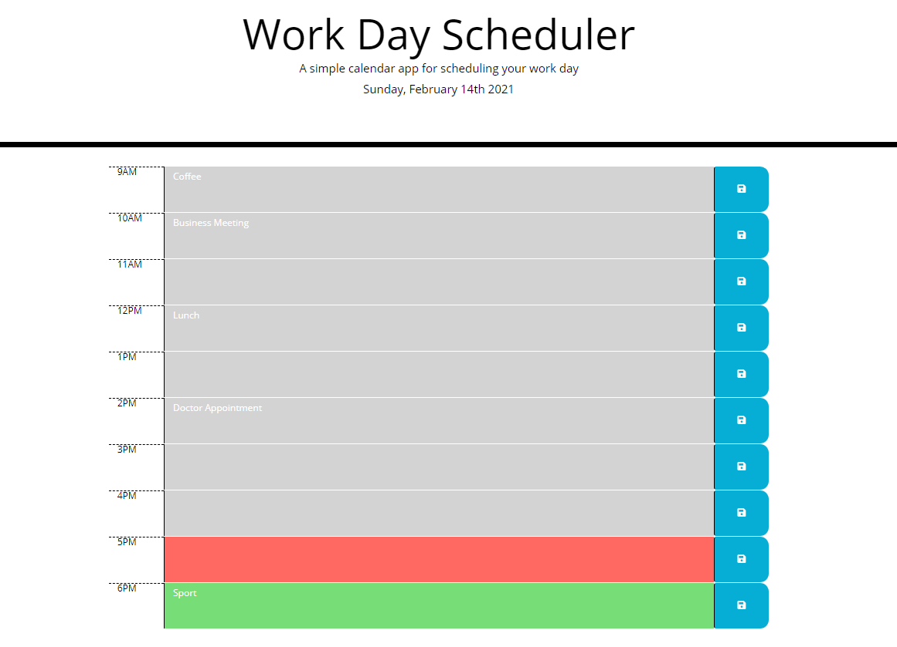

# day-planner

## Project Goal

Creat a day planner to log in your schedule of the day it will include the following features:

1. Today's date will be display on the top
2. For each hour you will be able to log in the schedule for that hour and save it.
3. When you uptade thepage the saved information will still be displayed.
4. Hours of the day that have passed will have a gray backround.
5. Current hour will have a red backround.
6. Upcoming hours will have a green backround

## Link to the page

https://zpinson.github.io/day-planner/g

## Preview images

